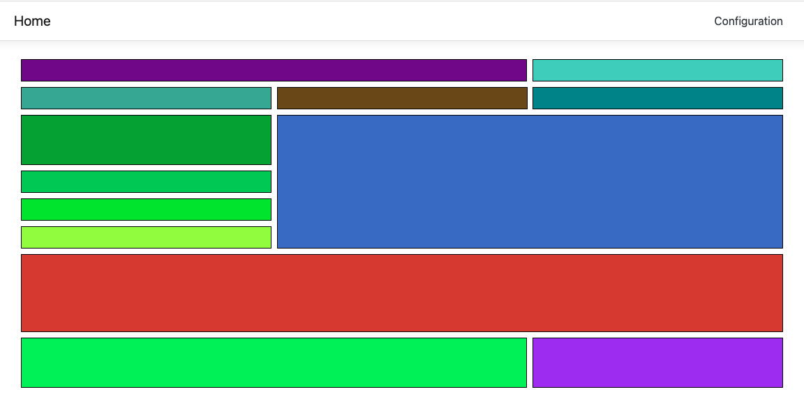
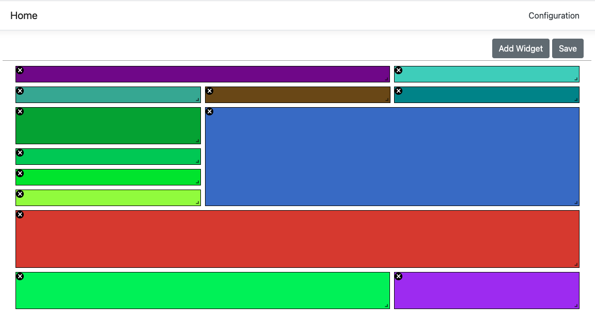
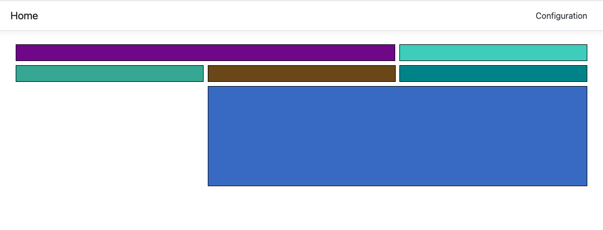
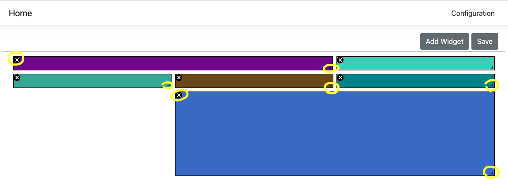

# Landa Assignment
Layout management rely on C# (server side) and React (client side), with MobX state manager. you can reset your own layout by click on "Configuration" link (top right corner), there you can add, remove, reorder and resize layout items.<br /><br />

### Code Design:
From design aspect, although this is a small (very small) system there is a strict separation between the tiers of the system, while incoming messages from outside handling representing with DTO's and pass to the domain tier through the service tier. <br />

Use of SOLID principles and design pattern such as: Dependency Injection, Decorators, Repository, Open/Close,  Interface segregation and Dependency Inversion principles<br />

### Project Structure:
-- LA.API -   Represent the RESTFul API service, the middleware tire.<br />
-- LA.Data - Represent the database access tier.<br />
-- LA.Domain - Represent the application domain.<br />
-- LA.Service - Represent the service tier, the mediator between the API and the Domain.<br />
-- LA.Web - represent the front-end, the entry point.<br /><br />

### Execute the app using visual studio:
Just start the app, the project sets as a multiple startup projects (API and WEB).<br /><br />

### Execute the app without visual studio:
Get into LA.API project by using powershell and run the command: ```dotnet rum```.<br />
Get into LA.Web/ClientApp with CLI such as powershell/CMD and run the command: ```npm start```.<br /><br />

Note: the server and the client running on different PORTS, the CORS problem resolved by PROXY setting in package.json ("proxy": "http://localhost:5001").<br />
Note: the background color to the layout generated randomly.<br /><br />

The following is an examples of layout results in edit/view modes:<br />




